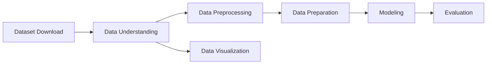

# Laporan Proyek Akhir Machine Learning Expert Dicoding: System Recommendation - Books - Sarah Adibah

## Table of Contents

- [Project Overview](#project-overview)
- [Business Understanding](#business-understanding)
- [Data Understanding](#data-understanding)
- [Data Preparation](#data-preparation)
- [Modeling](#modeling)
- [Evaluation](#evaluation)

## Project Overview

Di tengah pesatnya kemajuan teknologi digital dan derasnya arus informasi, kemampuan membaca tetap menjadi fondasi utama dalam proses pembelajaran dan menjadi benteng awal dalam menangkal informasi palsu atau hoaks yang marak tersebar di media sosial maupun platform digital lainnya. Namun, kenyataan di lapangan menunjukkan bahwa minat baca masyarakat Indonesia masih sangat rendah. UNESCO menyebut bahwa indeks minat baca di Indonesia hanya sebesar **0,001%**, artinya dari setiap 1.000 orang, hanya satu orang yang memiliki kebiasaan membaca secara aktif. Data serupa dari _World’s Most Literate Nations Ranked_ yang dilakukan oleh Central Connecticut State University pada 2016 juga menempatkan Indonesia di peringkat **ke-60 dari 61 negara**, tepat di bawah Thailand dan hanya sedikit lebih baik dari Botswana, meskipun secara infrastruktur literasi Indonesia berada di atas beberapa negara Eropa.[[1]](https://www.rri.co.id/daerah/649261/unesco-sebut-minat-baca-orang-indonesia-masih-rendah)

Meski begitu, masih ada harapan dari berbagai pihak untuk meningkatkan minat baca masyarakat. Salah satunya melalui studi dari _Programme for International Student Assessment (PISA)_ pada 2022 yang menunjukkan bahwa Indonesia naik lima peringkat dalam literasi membaca dibandingkan tahun 2018, walaupun skor yang didapatkan masih mengalami penurunan dan tetap berada di **11 posisi terbawah dari 81 negara**. Hal ini diperkuat oleh pernyataan Prof. Mochamad Nursalim dari Universitas Negeri Surabaya yang mengatakan bahwa rendahnya minat baca bukan hanya terjadi di masyarakat umum, tetapi juga di kalangan mahasiswa. Menurutnya, transformasi digital telah mengubah kebiasaan membaca dari buku fisik ke bentuk elektronik atau digital, namun hal ini belum tentu diikuti dengan peningkatan intensitas membaca itu sendiri.[[1]](https://www.rri.co.id/daerah/649261/unesco-sebut-minat-baca-orang-indonesia-masih-rendah)

Survei Perpustakaan Nasional Republik Indonesia pada tahun 2022 memperlihatkan peningkatan kegemaran membaca masyarakat, dengan skor nasional mencapai **63,9 poin**, dihitung berdasarkan frekuensi membaca dan durasi akses terhadap bacaan digital. Daerah Istimewa Yogyakarta menempati posisi tertinggi dengan skor **72,29 poin**, disusul oleh Jawa Tengah (70,96), Jawa Barat (70,1), DKI Jakarta (68,71), dan Jawa Timur (68,54). Rata-rata waktu yang dihabiskan masyarakat Indonesia untuk membaca dalam sehari mencapai **1 jam 37,8 menit**, atau **hampir 10 jam per minggu**, menandakan adanya pertumbuhan minat baca dibanding tahun-tahun sebelumnya. Namun demikian, jika dibandingkan secara global, Indonesia masih jauh tertinggal. Amerika Serikat, misalnya, memiliki rata-rata **17 buku** yang dibaca per orang per tahun, disusul India (**16 buku**) dan Inggris (**15 buku**). [[2]](https://infogarut.id/23-april-diperingati-sebagai-hari-buku-sedunia-apa-kabar-dengan-minat-baca-orang-indonesia)

Melihat kenyataan ini, perlu adanya inovasi teknologi yang dapat membantu meningkatkan budaya literasi masyarakat. Salah satu solusi yang potensial adalah pengembangan **sistem rekomendasi buku** berbasis _machine learning_ yang dapat membantu pengguna menemukan buku yang sesuai dengan minat, kebiasaan, dan preferensi mereka. Sistem ini dapat di-_deploy_ untuk berbagai kebutuhan, seperti katalog buku di perpustakaan, daftar rekomendasi buku digital, media sosial literasi seperti Medium, maupun _e-commerce_ buku seperti Gramedia Digital maupun Google Books. Dengan penerapan sistem ini, pengalaman membaca akan menjadi lebih personal, menyenangkan, dan efisien sehingga diharapkan mampu meningkatkan frekuensi dan minat baca masyarakat secara luas.

## Business Understanding
### Problem Statements
Berdasarkan latar belakang yang telah dijelaskan di atas, maka diperoleh rumusan masalah yang akan diselesaikan pada proyek ini, yaitu:

1.  Bagaimana cara melakukan tahap persiapan data buku, pengguna, dan _rating_ atau penilaian agar dapat digunakan sebagai informasi untuk membuat model _machine learning_ sistem rekomendasi?
    
2.  Bagaimana cara membuat model _machine learning_ untuk sistem rekomendasi buku?
    

### Goals

Berdasarkan rumusan masalah yang telah dipaparkan di atas, maka didapatkan tujuan dari proyek ini, yaitu:

1.  Melakukan tahap persiapan data sehingga data siap digunakan pada model _machine learning_ untuk sistem rekomendasi.
    
2.  Membuat model _machine learning_ untuk sistem rekomendasi buku terbaik kepada pengguna.

### Solution Statements
Dibawah ini merupakan diagram alir *(workflow)* yang digunakan dalam pengerjaan proyek ini

Berdasarkan tujuan dari proyek yang telah dipaparkan di atas, maka berikut adalah beberapa solusi yang dapat dilakukan agar dapat mencapai tujuan dari proyek ini, yaitu:
1.  **Tahap pra-pemrosesan data (data preprocessing)** merupakan proses awal yang bertujuan untuk mengubah data mentah menjadi data yang lebih rapi dan siap digunakan pada tahap berikutnya. Proses ini mencakup:
	-   Penyesuaian serta perubahan nama kolom atau atribut sehingga proses pemanggilan data menjadi lebih efisien.
	-   Penggabungan beberapa data yang terpisah agar dapat digunakan secara utuh pada proses analisis dan pemodelan selanjutnya.
    
2. **Tahap persiapan data (data preparation)** merupakan proses transformasi lanjutan agar data berada dalam format yang optimal untuk membangun model. Beberapa teknik yang dilakukan meliputi:
	-   Identifikasi nilai yang kosong atau tidak tersedia (_missing values_), lalu mengambil tindakan seperti menghapus data tersebut atau mengisinya dengan nilai tertentu agar tidak memengaruhi performa model.
	-   Deteksi data duplikat guna menghindari bias dalam hasil pemodelan.

3. **Tahap pembuatan model _machine learning_ untuk sistem rekomendasi buku** akan berfokus pada pembangunan sistem rekomendasi yang bersifat personal. Model akan dikembangkan menggunakan dua pendekatan utama, yaitu:
	-   _Content-based Recommendation_ merupakan metode yang menyarankan item yang memiliki kemiripan karakteristik dengan item yang sebelumnya disukai oleh pengguna. Pendekatan ini memanfaatkan profil preferensi pengguna berdasarkan data dari item yang telah diberi penilaian oleh pengguna lain sebelumnya dan merekomendasikan barang baru yang serupa kepada pengguna.[[3]](https://www.ibm.com/think/topics/content-based-filtering) Dalam implementasinya, _content-based filtering_ menggunakan algoritma _TF-IDF Vectorizer_ untuk merepresentasikan fitur item dalam bentuk vektor, serta _Cosine Similarity_ untuk mengukur tingkat kesamaan antar item.[[4]](https://medium.com/@prateekgaurav/step-by-step-content-based-recommendation-system-823bbfd0541c)
		- TF-IDF Vectorizer
		Algoritma Term Frequency-Inverse Document Frequency Vectorizer (TF-IDF Vectorizer) merupakan metode yang digunakan untuk menghitung dan mengubah teks mentah menjadi bentuk numerik bermakna dalam format matriks, sehingga dapat diproses dan dipahami oleh model _machine learning_.[[5]]((https://towardsdatascience.com/tf-idf-simplified-aba19d5f5530/))
		Keunggulan dari teknik ini adalah tidak memerlukan data dari pengguna lain karena rekomendasi yang dihasilkan bersifat personal dan disesuaikan secara khusus untuk masing-masing pengguna. Namun, kelemahannya terletak pada keterbatasan rekomendasi yang hanya berasal dari preferensi pengguna tersebut, sehingga tidak memanfaatkan informasi dari penilaian pengguna lain untuk memperluas hasil rekomendasi. TF-IDF dapat dihitung menggunakan rumus sebagai berikut:
		$$idf_i=log \left( \frac{n}{df_i} \right)$$
		Nilai $idf_i$ adalah skor Inverse Document Frequency untuk _term_ $i$, dengan $df_i$ menunjukkan jumlah dokumen yang mengandung _term_ tersebut, dan $n$ mewakili total seluruh dokumen. Semakin banyak dokumen yang mengandung _term_ tertentu (semakin tinggi $df$), maka nilai $idf$-nya akan semakin rendah. Jika suatu _term_ muncul di semua dokumen ($df = n$), maka nilai $idf$ menjadi 0 karena $log(1) = 0$.
		Sedangkan Nilai TF-IDF diperoleh dari hasil perkalian antara matriks frekuensi term (TF) dengan nilai Inverse Document Frequency (IDF) masing-masing term.
		$$w_{i,j}=tf_{i,j} \times idf_i$$
		Skor TF-IDF $w_{i,j}$ menunjukkan bobot _term_ $i$ dalam dokumen $j$, yang diperoleh dari hasil perkalian antara frekuensi _term_ $tf_{i,j}$ dalam dokumen $j$ dan skor IDF $idf_i$ dari _term_ tersebut.
		- Cosine Similarity
		Teknik **cosine similarity** digunakan untuk menghitung tingkat kemiripan antara dua sampel berdasarkan sudut di antara vektor representasinya. [[6]](https://www.sciencedirect.com/topics/computer-science/cosine-similarity)
		$$
S_c(A,B) = \cos(\theta) = \frac{A \times B}{\|A\| \|B\|} = \frac{\displaystyle\sum^{n}_{i=1} A_i B_i}{\sqrt{\displaystyle\sum^{n}_{i=1} A^{2}_{i}} \sqrt{\displaystyle\sum^{n}_{i=1} B^{2}_{i}}}
$$
$A_i$ dan $B_i$ adalah elemen-elemen penyusun vektor A dan B masing-masing.

	-   _Collaborative Filtering Recommendation_

## Data Understanding

## Informasi Dataset

| Keterangan             | Detail                                                                                     |
|------------------------|--------------------------------------------------------------------------------------------|
| Sumber                 | [Kaggle Dataset: Books Dataset](https://www.kaggle.com/datasets/saurabhbagchi/books-dataset) |
| Usability              | 10.00                                                                                      |
| Lisensi                | CC0: Public Domain                                                                         |
| Penilaian/Rating       | Silver                                                                                     |
| Jenis & Ukuran Berkas | ZIP (26 MB)                                                                              |
| Kategori               | Business, Literature, E-Commerce Services, Recommender Systems, Marketing                  |

Deskripsi statistik untuk _dataset_  `ratings` pada fitur `Book-Rating` dapat dilihat pada tabel di bawah ini.
|                  | **Book-Rating**|
|------------------|----------------|
| **count**        | 1,149,780      |
| **mean**         | 3         		|
| **std**          | 4        	 	|
| **min**          | 0         		|
| **25%**          | 0         		|
| **50%**          | 0         		|
| **75%**          | 7         		|
| **max**          | 10        		|
| **dtype**         object    		|

## Data Preparation

## Modeling

## Evaluation
