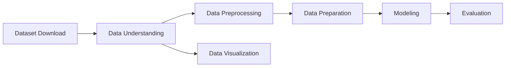

# Laporan Proyek Akhir Machine Learning Expert Dicoding: System Recommendation - Books - Sarah Adibah

## Table of Contents

- [Project Overview](#project-overview)
- [Business Understanding](#business-understanding)
- [Data Understanding](#data-understanding)
- [Data Preparation](#data-preparation)
- [Modeling](#modeling)
- [Evaluation](#evaluation)

## Project Overview

Di tengah pesatnya kemajuan teknologi digital dan derasnya arus informasi, kemampuan membaca tetap menjadi fondasi utama dalam proses pembelajaran dan menjadi benteng awal dalam menangkal informasi palsu atau hoaks yang marak tersebar di media sosial maupun platform digital lainnya. Namun, kenyataan di lapangan menunjukkan bahwa minat baca masyarakat Indonesia masih sangat rendah. UNESCO menyebut bahwa indeks minat baca di Indonesia hanya sebesar **0,001%**, artinya dari setiap 1.000 orang, hanya satu orang yang memiliki kebiasaan membaca secara aktif. Data serupa dari _World’s Most Literate Nations Ranked_ yang dilakukan oleh Central Connecticut State University pada 2016 juga menempatkan Indonesia di peringkat **ke-60 dari 61 negara**, tepat di bawah Thailand dan hanya sedikit lebih baik dari Botswana, meskipun secara infrastruktur literasi Indonesia berada di atas beberapa negara Eropa.[[1]](https://www.rri.co.id/daerah/649261/unesco-sebut-minat-baca-orang-indonesia-masih-rendah)

Meski begitu, masih ada harapan dari berbagai pihak untuk meningkatkan minat baca masyarakat. Salah satunya melalui studi dari _Programme for International Student Assessment (PISA)_ pada 2022 yang menunjukkan bahwa Indonesia naik lima peringkat dalam literasi membaca dibandingkan tahun 2018, walaupun skor yang didapatkan masih mengalami penurunan dan tetap berada di **11 posisi terbawah dari 81 negara**. Hal ini diperkuat oleh pernyataan Prof. Mochamad Nursalim dari Universitas Negeri Surabaya yang mengatakan bahwa rendahnya minat baca bukan hanya terjadi di masyarakat umum, tetapi juga di kalangan mahasiswa. Menurutnya, transformasi digital telah mengubah kebiasaan membaca dari buku fisik ke bentuk elektronik atau digital, namun hal ini belum tentu diikuti dengan peningkatan intensitas membaca itu sendiri.[[1]](https://www.rri.co.id/daerah/649261/unesco-sebut-minat-baca-orang-indonesia-masih-rendah)

Survei Perpustakaan Nasional Republik Indonesia pada tahun 2022 memperlihatkan peningkatan kegemaran membaca masyarakat, dengan skor nasional mencapai **63,9 poin**, dihitung berdasarkan frekuensi membaca dan durasi akses terhadap bacaan digital. Daerah Istimewa Yogyakarta menempati posisi tertinggi dengan skor **72,29 poin**, disusul oleh Jawa Tengah (70,96), Jawa Barat (70,1), DKI Jakarta (68,71), dan Jawa Timur (68,54). Rata-rata waktu yang dihabiskan masyarakat Indonesia untuk membaca dalam sehari mencapai **1 jam 37,8 menit**, atau **hampir 10 jam per minggu**, menandakan adanya pertumbuhan minat baca dibanding tahun-tahun sebelumnya. Namun demikian, jika dibandingkan secara global, Indonesia masih jauh tertinggal. Amerika Serikat, misalnya, memiliki rata-rata **17 buku** yang dibaca per orang per tahun, disusul India (**16 buku**) dan Inggris (**15 buku**). [[2]](https://infogarut.id/23-april-diperingati-sebagai-hari-buku-sedunia-apa-kabar-dengan-minat-baca-orang-indonesia)

Melihat kenyataan ini, perlu adanya inovasi teknologi yang dapat membantu meningkatkan budaya literasi masyarakat. Salah satu solusi yang potensial adalah pengembangan **sistem rekomendasi buku** berbasis _machine learning_ yang dapat membantu pengguna menemukan buku yang sesuai dengan minat, kebiasaan, dan preferensi mereka. Sistem ini dapat di-_deploy_ untuk berbagai kebutuhan, seperti katalog buku di perpustakaan, daftar rekomendasi buku digital, media sosial literasi seperti Medium, maupun _e-commerce_ buku seperti Gramedia Digital maupun Google Books. Dengan penerapan sistem ini, pengalaman membaca akan menjadi lebih personal, menyenangkan, dan efisien sehingga diharapkan mampu meningkatkan frekuensi dan minat baca masyarakat secara luas.

## Business Understanding
### Problem Statements

### Goals

### Solution Statements
Dibawah ini merupakan diagram alir *(workflow)* yang digunakan dalam pengerjaan proyek ini

## Data Understanding

## Informasi Dataset

| Keterangan             | Detail                                                                                     |
|------------------------|--------------------------------------------------------------------------------------------|
| Sumber                 | [Kaggle Dataset: Books Dataset](https://www.kaggle.com/datasets/saurabhbagchi/books-dataset) |
| Usability              | 10.00                                                                                      |
| Lisensi                | CC0: Public Domain                                                                         |
| Penilaian/Rating       | Silver                                                                                     |
| Jenis & Ukuran Berkas | ZIP (26 MB)                                                                              |
| Kategori               | Business, Literature, E-Commerce Services, Recommender Systems, Marketing                  |

Deskripsi statistik untuk _dataset_  `ratings` pada fitur `Book-Rating` dapat dilihat pada tabel di bawah ini.
|                  | **Book-Rating**|
|------------------|----------------|
| **count**        | 1,149,780      |
| **mean**         | 3         		|
| **std**          | 4        	 	|
| **min**          | 0         		|
| **25%**          | 0         		|
| **50%**          | 0         		|
| **75%**          | 7         		|
| **max**          | 10        		|
| **dtype**         object    		|

## Data Preparation

## Modeling

## Evaluation
