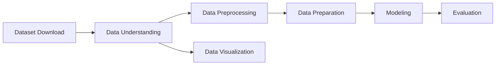

# Laporan Proyek Akhir Machine Learning Expert Dicoding: System Recommendation - Books - Sarah Adibah

## Table of Contents

- [Project Overview](#project-overview)
- [Business Understanding](#business-understanding)
- [Data Understanding](#data-understanding)
- [Data Preprocessing](#data-preprocessing)
- [Data Preparation](#data-preparation)
- [Modeling](#modeling)
- [Evaluation](#evaluation)
- [Kesimpulan](#kesimpulan)
- [Referensi](#referensi)
  
## Project Overview

Di tengah pesatnya kemajuan teknologi digital dan derasnya arus informasi, kemampuan membaca tetap menjadi fondasi utama dalam proses pembelajaran dan menjadi benteng awal dalam menangkal informasi palsu atau hoaks yang marak tersebar di media sosial maupun platform digital lainnya. Namun, kenyataan di lapangan menunjukkan bahwa minat baca masyarakat Indonesia masih sangat rendah. UNESCO menyebut bahwa indeks minat baca di Indonesia hanya sebesar **0,001%**, artinya dari setiap 1.000 orang, hanya satu orang yang memiliki kebiasaan membaca secara aktif. Data serupa dari _World’s Most Literate Nations Ranked_ yang dilakukan oleh Central Connecticut State University pada 2016 juga menempatkan Indonesia di peringkat **ke-60 dari 61 negara**, tepat di bawah Thailand dan hanya sedikit lebih baik dari Botswana, meskipun secara infrastruktur literasi Indonesia berada di atas beberapa negara Eropa.[[1]](https://www.rri.co.id/daerah/649261/unesco-sebut-minat-baca-orang-indonesia-masih-rendah)

Meski begitu, masih ada harapan dari berbagai pihak untuk meningkatkan minat baca masyarakat. Salah satunya melalui studi dari _Programme for International Student Assessment (PISA)_ pada 2022 yang menunjukkan bahwa Indonesia naik lima peringkat dalam literasi membaca dibandingkan tahun 2018, walaupun skor yang didapatkan masih mengalami penurunan dan tetap berada di **11 posisi terbawah dari 81 negara**. Hal ini diperkuat oleh pernyataan Prof. Mochamad Nursalim dari Universitas Negeri Surabaya yang mengatakan bahwa rendahnya minat baca bukan hanya terjadi di masyarakat umum, tetapi juga di kalangan mahasiswa. Menurutnya, transformasi digital telah mengubah kebiasaan membaca dari buku fisik ke bentuk elektronik atau digital, namun hal ini belum tentu diikuti dengan peningkatan intensitas membaca itu sendiri.[[1]](https://www.rri.co.id/daerah/649261/unesco-sebut-minat-baca-orang-indonesia-masih-rendah)

Survei Perpustakaan Nasional Republik Indonesia pada tahun 2022 memperlihatkan peningkatan kegemaran membaca masyarakat, dengan skor nasional mencapai **63,9 poin**, dihitung berdasarkan frekuensi membaca dan durasi akses terhadap bacaan digital. Daerah Istimewa Yogyakarta menempati posisi tertinggi dengan skor **72,29 poin**, disusul oleh Jawa Tengah (70,96), Jawa Barat (70,1), DKI Jakarta (68,71), dan Jawa Timur (68,54). Rata-rata waktu yang dihabiskan masyarakat Indonesia untuk membaca dalam sehari mencapai **1 jam 37,8 menit**, atau **hampir 10 jam per minggu**, menandakan adanya pertumbuhan minat baca dibanding tahun-tahun sebelumnya. Namun demikian, jika dibandingkan secara global, Indonesia masih jauh tertinggal. Amerika Serikat, misalnya, memiliki rata-rata **17 buku** yang dibaca per orang per tahun, disusul India (**16 buku**) dan Inggris (**15 buku**). [[2]](https://infogarut.id/23-april-diperingati-sebagai-hari-buku-sedunia-apa-kabar-dengan-minat-baca-orang-indonesia)

Melihat kenyataan ini, perlu adanya inovasi teknologi yang dapat membantu meningkatkan budaya literasi masyarakat. Salah satu solusi yang potensial adalah pengembangan **sistem rekomendasi buku** berbasis _machine learning_ yang dapat membantu pengguna menemukan buku yang sesuai dengan minat, kebiasaan, dan preferensi mereka. Sistem ini dapat di-_deploy_ untuk berbagai kebutuhan, seperti katalog buku di perpustakaan, daftar rekomendasi buku digital, media sosial literasi seperti Medium, maupun _e-commerce_ buku seperti Gramedia Digital maupun Google Books. Dengan penerapan sistem ini, pengalaman membaca akan menjadi lebih personal, menyenangkan, dan efisien sehingga diharapkan mampu meningkatkan frekuensi dan minat baca masyarakat secara luas.

## Business Understanding
### Problem Statements
Berdasarkan latar belakang yang telah dijelaskan di atas, maka diperoleh rumusan masalah yang akan diselesaikan pada proyek ini, yaitu:

1.  Bagaimana cara melakukan tahap persiapan data buku, pengguna, dan _rating_ atau penilaian agar dapat digunakan sebagai informasi untuk membuat model _machine learning_ sistem rekomendasi?
    
2.  Bagaimana cara membuat model _machine learning_ untuk sistem rekomendasi buku?
    

### Goals

Berdasarkan rumusan masalah yang telah dipaparkan di atas, maka didapatkan tujuan dari proyek ini, yaitu:

1.  Melakukan tahap persiapan data sehingga data siap digunakan pada model _machine learning_ untuk sistem rekomendasi.
    
2.  Membuat model _machine learning_ untuk sistem rekomendasi buku terbaik kepada pengguna.

### Solution Statements
Dibawah ini merupakan diagram alir *(workflow)* yang digunakan dalam pengerjaan proyek ini

Berdasarkan tujuan dari proyek yang telah dipaparkan di atas, maka berikut adalah beberapa solusi yang dapat dilakukan agar dapat mencapai tujuan dari proyek ini, yaitu:
1.  **Tahap pra-pemrosesan data (data preprocessing)** merupakan proses awal yang bertujuan untuk mengubah data mentah menjadi data yang lebih rapi dan siap digunakan pada tahap berikutnya. Proses ini mencakup:
	-   Penyesuaian serta perubahan nama kolom atau atribut sehingga proses pemanggilan data menjadi lebih efisien.
	-   Penggabungan beberapa data yang terpisah agar dapat digunakan secara utuh pada proses analisis dan pemodelan selanjutnya.
    
2. **Tahap persiapan data (data preparation)** merupakan proses transformasi lanjutan agar data berada dalam format yang optimal untuk membangun model. Beberapa teknik yang dilakukan meliputi:
	-   Identifikasi nilai yang kosong atau tidak tersedia (_missing values_), lalu mengambil tindakan seperti menghapus data tersebut atau mengisinya dengan nilai tertentu agar tidak memengaruhi performa model.
	-   Deteksi data duplikat guna menghindari bias dalam hasil pemodelan.

3. **Tahap pembuatan model _machine learning_ untuk sistem rekomendasi buku** akan berfokus pada pembangunan sistem rekomendasi yang bersifat personal. Model akan dikembangkan menggunakan dua pendekatan utama, yaitu:
	-   _Content-based Recommendation_ merupakan metode yang menyarankan item yang memiliki kemiripan karakteristik dengan item yang sebelumnya disukai oleh pengguna. Pendekatan ini memanfaatkan profil preferensi pengguna berdasarkan data dari item yang telah diberi penilaian oleh pengguna lain sebelumnya dan merekomendasikan barang baru yang serupa kepada pengguna.[[3]](https://www.ibm.com/think/topics/content-based-filtering) Dalam implementasinya, _content-based filtering_ menggunakan algoritma _TF-IDF Vectorizer_ untuk merepresentasikan fitur item dalam bentuk vektor, serta _Cosine Similarity_ untuk mengukur tingkat kesamaan antar item.[[4]](https://medium.com/@prateekgaurav/step-by-step-content-based-recommendation-system-823bbfd0541c)
		- TF-IDF Vectorizer (Term Frequency-Inverse Document Frequency Vectorizer) merupakan metode yang digunakan untuk menghitung dan mengubah teks mentah menjadi bentuk numerik bermakna dalam format matriks, sehingga dapat diproses dan dipahami oleh model _machine learning_.[[5]]((https://towardsdatascience.com/tf-idf-simplified-aba19d5f5530/))
Keunggulan dari teknik ini adalah tidak memerlukan data dari pengguna lain karena rekomendasi yang dihasilkan bersifat personal dan disesuaikan secara khusus untuk masing-masing pengguna. Namun, kelemahannya terletak pada keterbatasan rekomendasi yang hanya berasal dari preferensi pengguna tersebut, sehingga tidak memanfaatkan informasi dari penilaian pengguna lain untuk memperluas hasil rekomendasi. TF-IDF dapat dihitung menggunakan rumus sebagai berikut:

		$$idf_i=log \left( \frac{n}{df_i} \right)$$

		Nilai $idf_i$ adalah skor Inverse Document Frequency untuk _term_ $i$, dengan $df_i$ menunjukkan jumlah dokumen yang mengandung _term_ tersebut, dan $n$ mewakili total seluruh dokumen. Semakin banyak dokumen yang mengandung _term_ tertentu (semakin tinggi $df$), maka nilai $idf$-nya akan semakin rendah. Jika suatu _term_ muncul di semua dokumen ($df = n$), maka nilai $idf$ menjadi 0 karena $log(1) = 0$.
		Sedangkan Nilai TF-IDF diperoleh dari hasil perkalian antara matriks frekuensi term (TF) dengan nilai Inverse Document Frequency (IDF) masing-masing term.

		$$w_{i,j}=tf_{i,j} \times idf_i$$

		Skor TF-IDF $w_{i,j}$ menunjukkan bobot _term_ $i$ dalam dokumen $j$, yang diperoleh dari hasil perkalian antara frekuensi _term_ $tf_{i,j}$ dalam dokumen $j$ dan skor IDF $idf_i$ dari _term_ tersebut.
		- Cosine Similarity
		Teknik **cosine similarity** digunakan untuk menghitung tingkat kemiripan antara dua sampel berdasarkan sudut di antara vektor representasinya. [[6]](https://www.sciencedirect.com/topics/computer-science/cosine-similarity)

			$$S_c(A,B) = \cos(\theta) = \frac{A \times B}{\|A\| \|B\|} = \frac{\displaystyle\sum_{i=1}^{n} {A_i}{B_i}}{\sqrt{\displaystyle\sum_{i=1}^{n} A_{i}^{2}} \sqrt{\displaystyle\sum_{i=1}^{n} B_{i}^{2}}}$$

			$A_i$ dan $B_i$ adalah elemen-elemen penyusun vektor A dan B masing-masing.

-   _Collaborative Filtering Recommendation_
			Sistem rekomendasi yang bekerja dengan cara merekomendasikan item berdasarkan kesamaan preferensi atau interaksi antar pengguna. Berbeda dengan content-based filtering yang fokus merekomendasikan item berdasarkan fitur dari item itu sendiri, collaborative filtering memanfaatkan pola kesamaan antar pengguna untuk memberikan rekomendasi yang lebih personal dan relevan bagi kelompok pengguna tertentu.[[7]](https://www.ibm.com/think/topics/collaborative-filtering)
			Collaborative filtering unggul dalam memberikan rekomendasi yang beragam dan personal berdasarkan kesamaan minat pengguna lain, sehingga bisa menyarankan item baru yang relevan. Namun, metode ini memiliki kekurangan seperti _cold start_ pada pengguna atau item baru tanpa data interaksi, serta masalah _data sparsity_ yang menyulitkan sistem menemukan pola yang tepat. [[7]](https://www.ibm.com/think/topics/collaborative-filtering)

[←Table of Contents](#table-of-contents)

## Data Understanding

Data yang digunakan dalam proyek ini berasal dari _dataset_ yang diunduh dari Kaggle. Berikut ini adalah rincian informasi mengenai _dataset_ tersebut.

| Keterangan             | Detail                                                                                     |
|------------------------|--------------------------------------------------------------------------------------------|
| Sumber                 | [Kaggle Dataset: Books Dataset](https://www.kaggle.com/datasets/saurabhbagchi/books-dataset) |
| Usability              | 10.00                                                                                      |
| Lisensi                | CC0: Public Domain                                                                         |
| Penilaian/Rating       | Silver                                                                                     |
| Jenis & Ukuran Berkas | ZIP (26 MB)                                                                              |
| Kategori               | Business, Literature, E-Commerce Services, Recommender Systems, Marketing                  |

Dalam dataset tersebut berisi tiga (3) berkas CSV ([Comma-separated Values](https://docs.python.org/3/library/csv.html)), yaitu `books.csv`, `ratings.csv`, `users.csv` yang terdapat di dalam folder `books_data`.

1. **books.csv**, memiliki atribut atau fitur sebagai berikut,

- `ISBN` : *International Standard Book Number*
- `Book-Title` : Judul buku
- `Book-Author` : Penulis buku
- `Year-Of-Publication` : Tahun terbit buku
- `Publisher` : Penerbit buku
- `Image-URL-S` : Tautan sampul buku ukuran kecil
- `Image-URL-M` : Tautan sampul buku ukuran sedang
- `Image-URL-L` : Tautan sampul buku ukuran besar
  
2. **ratings.csv**, memiliki atribut atau fitur sebagai berikut,

- `User-ID` : Identitas unik pengguna berupa bilangan bulat atau integer
- `ISBN` : *International Standard Book Number*
- `Book-Rating` : *Rating* buku yang diberikan pengguna
  
3. **users.csv**, memiliki atribut atau fitur sebagai berikut,

- `User-ID` : Identitas unik pengguna berupa bilangan bulat atau integer
- `Location` : Lokasi tempat tinggal pengguna
- `Age` : Umur pengguna

Deskripsi statistik untuk _dataset_  `ratings` pada fitur `Book-Rating` dapat dilihat pada tabel di bawah ini.
|                  | **Book-Rating**|
|------------------|----------------|
| **count**        | 1,149,780      |
| **mean**         | 3         		|
| **std**          | 4        	 	|
| **min**          | 0         		|
| **25%**          | 0         		|
| **50%**          | 0         		|
| **75%**          | 7         		|
| **max**          | 10        		|
| **dtype**         object    		|

Dari tabel di atas dapat dilihat bahwa terdapat,
- Total jumlah data (`count`) sebanyak 1.149.780;
- Rata-rata *rating* (`mean`) 3;
- Simpangan baku/standar deviasi *rating* (`std`) 4;
- *Rating* Minimal (`min`), kuartil bawah/Q1 *rating* (`25%`), kuartil tengah/Q2/median *rating* (`50%`) 0;
- Kuartil atas/Q3 *rating* (`75%`) 7;
- *Rating* maksimum (`max`) 10

Berikut merupakan visualisasi grafik histogram yang menampilkan frekuensi distribusi *rating* yang diberikan pengguna terhadap buku yang telah mereka baca, dengan rentang nilai dari 0 hingga 10.

Dari visualisasi grafik histogram "Jumlah Rating Buku" di atas, terlihat bahwa *rating* yang paling sering muncul adalah *rating* 0, dengan jumlah lebih dari 700.000. Kehadiran rating 0 ini berpotensi menimbulkan bias dan memengaruhi hasil analisis, sehingga rating tersebut sebaiknya dihapus pada tahap [data preparation](#data-preparation).

[←Table of Contents](#table-of-contents)

## Data Preprocessing
Tahap _data preprocessing_ atau pra-pemrosesan data bertujuan untuk mengolah data mentah *(raw data)* menjadi data yang bersih *(clean data)* dan siap digunakan dalam proses analisis berikutnya. Proses ini mencakup beberapa langkah penting, antara lain:
- **Mengubah Nama Kolom/Atribut/Fitur** 
Penggantian nama kolom, atribut, atau fitur pada masing-masing _dataframe_ dilakukan untuk mempermudah proses akses dan manipulasi data di tahap selanjutnya.

1. Books

| isbn        | book_title                                      | book_author           | year_pub | publisher               | image_url_s                                         | image_url_m                                         | image_url_l                                         |
|-------------|--------------------------------------------------|------------------------|-----------|--------------------------|------------------------------------------------------|------------------------------------------------------|------------------------------------------------------|
| 0195153448  | Classical Mythology                              | Mark P. O. Morford     | 2002      | Oxford University Press  | http://images.amazon.com/images/P/0195153448.0.jpg | http://images.amazon.com/images/P/0195153448.0.jpg | http://images.amazon.com/images/P/0195153448.0.jpg |
| 0002005018  | Clara Callan                                     | Richard Bruce Wright   | 2001      | HarperFlamingo Canada    | http://images.amazon.com/images/P/0002005018.0.jpg | http://images.amazon.com/images/P/0002005018.0.jpg | http://images.amazon.com/images/P/0002005018.0.jpg |
| 0060973129  | Decision in Normandy                             | Carlo D'Este           | 1991      | HarperPerennial          | http://images.amazon.com/images/P/0060973129.0.jpg | http://images.amazon.com/images/P/0060973129.0.jpg | http://images.amazon.com/images/P/0060973129.0.jpg |
| 0374157065  | Flu: The Story of the Great Influenza Pandemic...| Gina Bari Kolata       | 1999      | Farrar Straus Giroux     | http://images.amazon.com/images/P/0374157065.0.jpg | http://images.amazon.com/images/P/0374157065.0.jpg | http://images.amazon.com/images/P/0374157065.0.jpg |
| 0393045218  | The Mummies of Urumchi                           | E. J. W. Barber         | 1999      | W. W. Norton & Company   | http://images.amazon.com/images/P/0393045218.0.jpg | http://images.amazon.com/images/P/0393045218.0.jpg | http://images.amazon.com/images/P/0393045218.0.jpg |

 
2. Ratings
	
| user_id | isbn        | book_rating |
|---------|-------------|-------------|
| 276725  | 034545104X  | 0           |
| 276726  | 0155061224  | 5           |
| 276727  | 0446520802  | 0           |
| 276729  | 052165615X  | 3           |
| 276729  | 0521795028  | 6           |
	

 	
3. User
    
| user_id | location                         | age  |
|---------|----------------------------------|------|
| 2       | stockton, california, usa        | 18.0 |
| 4       | porto, v.n.gaia, portugal        | 17.0 |
| 6       | santa monica, california, usa    | 61.0 |
| 10      | albacete, wisconsin, spain       | 26.0 |
| 11      | melbourne, victoria, australia   | 14.0 |

 

- **Menggabungkan Data ISBN**
Penggabungan data ISBN buku dilakukan dengan memanfaatkan fungsi `.concatenate` dari _library_ [`numpy`](https://numpy.org/). Karena informasi ISBN terdapat pada _dataframe_ buku dan _dataframe_ _rating_, maka dilakukan penyatuan data berdasarkan kolom `isbn`.

- **Menggabungkan Data User**
Sementara itu, penggabungan data `user_id` dilakukan juga menggunakan fungsi `.concatenate` dari _library_ [`numpy`](https://numpy.org/). Kolom `user_id` terdapat pada _dataframe_ _rating_ dan _user_, sehingga proses penggabungan dilakukan berdasarkan atribut `user_id`.

[←Table of Contents](#table-of-contents)

## Data Preparation
Tahap _data preparation_ dilakukan proses transformasi data agar memiliki format yang sesuai untuk keperluan pemodelan. Beberapa langkah dilakukan dalam proses ini, antara lain:
- Pengecekan *Missing Value*
  
	Pemeriksaan terhadap data kosong, hilang, _null_, atau _missing value_ dilakukan dan ditemukan pada _dataframe_ `books`, sehingga data yang hilang tersebut dihapus.
 
	 Sementara itu, pada _dataframe_ `ratings` tidak ditemukan _missing value_, namun perlu dilakukan penghapusan terhadap _rating_ bernilai 0. Hal ini dikarenakan _rating_ 0 merupakan kategori terbanyak berdasarkan hasil [_data understanding_](#data-understanding) sebelumnya, yaitu sebanyak 716.109 data. Jumlah tersebut berpotensi menimbulkan bias dalam analisis data, sehingga _rating_ 0 tidak disertakan dalam proses visualisasi grafik histogram berikutnya.

	

	Setelah _rating_ 0 dihapus, hasil visualisasi grafik histogram menunjukkan pola distribusi frekuensi data yang lebih terstruktur dan mudah dibaca, khususnya pada rentang _rating_ 1 hingga 4.

	Kemudian pada *dataframe* `Users`, terdapat sebanyak 110.762 *missing value* pada fitur umur yang terdapat nilai kosong atau tidak valid seperti `'NaN'`, `'nan'`, `' '`, dan tanda kutip tunggal (`'`). 
	
| user_id | location                          | age  |
|---------|-----------------------------------|------|
| 1       | nyc, new york, usa                | NaN  |
| 2       | stockton, california, usa         | 18.0 |
| 3       | moscow, yukon territory, russia   | NaN  |
| 4       | porto, v.n.gaia, portugal         | 17.0 |
| 5       | farnborough, hants, united kingdom| NaN  |
| ...     | ...                               | ...  |
| 278854  | portland, oregon, usa             | NaN  |
| 278855  | tacoma, washington, united kingdom| 50.0 |
| 278856  | brampton, ontario, canada         | NaN  |
| 278857  | knoxville, tennessee, usa         | NaN  |
| 278858  | dublin, n/a, ireland              | NaN  |
|278858 rows × 3 columns|

Oleh karena itu, dilakukan proses pembersihan data dengan mengganti nilai-nilai tersebut menjadi `np.nan`. Selanjutnya, kolom `age` dikonversi ke tipe numerik agar bisa dianalisis, dan baris yang masih mengandung nilai NaN dihapus menggunakan fungsi `dropna()`.
	
| user_id | location                         | age  |
|---------|---------------------------------|------|
| 1       | nyc, new york, usa              | 24.0 |
| 2       | stockton, california, usa       | 18.0 |
| 4       | porto, v.n.gaia, portugal       | 17.0 |
| 6       | santa monica, california, usa   | 61.0 |
| 10      | albacete, wisconsin, spain      | 26.0 |
| ...     | ...                             | ...  |
| 278849  | georgetown, ontario, canada     | 23.0 |
| 278851  | dallas, texas, usa              | 33.0 |
| 278852  | brisbane, queensland, australia | 32.0 |
| 278853  | stranraer, n/a, united kingdom  | 17.0 |
| 278855  | tacoma, washington, united kingdom | 50.0 |
| 168097 rows × 3 columns|

Pemeriksaan ulang terhadap *dataframe*  `users` menunjukkan bahwa tidak ada nilai kosong atau *null* yang ditemukan di seluruh kolomnya.

Berdasarkan hasil visualisasi grafik histogram umur *user* di atas, dapat dilihat bahwa mayoritas pengguna berada pada rentang usia 20—40 tahun, dengan puncak distribusi antara 30—35 tahun.

Terdapat pula sebagian kecil pengguna dengan usia di bawah 10 tahun dan di atas 80 tahun, namun jumlahnya jauh lebih sedikit dibandingkan kelompok usia produktif. Hal ini menunjukkan bahwa sistem rekomendasi buku kemungkinan besar akan lebih relevan jika disesuaikan dengan preferensi kelompok usia 20—40 tahun.

- Pengecekan Data Duplikat

 
- Data Buku dan *Rating*
	

[←Table of Contents](#table-of-contents)

## Modeling

[←Table of Contents](#table-of-contents)

## Evaluation

[←Table of Contents](#table-of-contents)

## Kesimpulan

[←Table of Contents](#table-of-contents)

## Referensi

[←Table of Contents](#table-of-contents)

