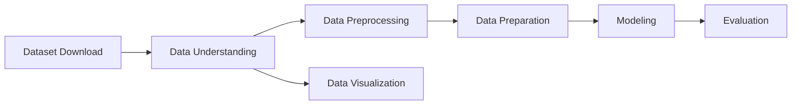

# Laporan Proyek Akhir Machine Learning Expert Dicoding: System Recommendation - Books - Sarah Adibah

## Table of Contents

- [Project Overview](#project-overview)
- [Business Understanding](#business-understanding)
- [Data Understanding](#data-understanding)
- [Data Preparation](#data-preparation)
- [Modeling](#modeling)
- [Evaluation](#evaluation)

## Project Overview

## Business Understanding
### Problem Statements

### Goals

### Solution Statements
Dibawah ini merupakan diagram alir *(workflow)* yang digunakan dalam pengerjaan proyek ini

## Data Understanding

## Data Preparation

## Modeling

## Evaluation
